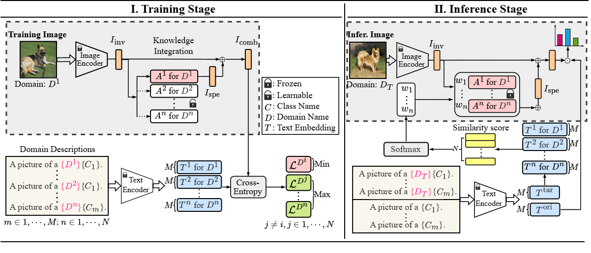

# Domain-Specific Knowledge through Domain Description for Generalization


## Abstract
Most domain generalization methods focus on learning domain-invariant knowledge from source domains, neglecting the value of domain-specific knowledge, which, though unique to each source domain, can also improve the model's generalizability to unseen domains. To fill this gap, we propose the dOmain Description-guided Experts (ODE) framework, which leverages domain description to guide the utilization of domain-specific knowledge during both training and inference phases. Specifically, the domain descriptions are formulated as prompts incorporating domain names. During training, ODE constructs multiple domain experts, each specializing in a specific source domain. These domain experts leverage domain descriptions to facilitate the learning of domain-specific knowledge through text-image contrastive learning. By sharing a frozen, pretrained backbone network while only training the domain experts, ODE preserves domain-invariant knowledge while capturing unique domain knowledge. During inference, ODE computes the similarities between target and source domain descriptions to determine the relevance of each source domain to the unseen target domain. It then leverages domain-specific knowledge from the domain with the highest similarity to facilitate the inference. Moreover, we propose a strategy that allows ODE to integrate domain-specific knowledge from multiple domains, further improving generalization performance. Experiments across seven benchmark datasets demonstrate the effectiveness of ODE, setting a new benchmark of 95.5\% average accuracy on the PACS dataset.

## Baselines
DG approachs:
- ERM
- 2018 - CrossGrad - [Generalizing Across Domains via Cross-Gradient Training](https://openreview.net/forum?id=r1Dx7fbCW)
- 2020 - DDAIG - [Deep Domain-Adversarial Image Generation for Domain Generalization](https://ojs.aaai.org/index.php/AAAI/article/view/7003)
- 2021 - MixStyle - [Domain Generalization with MixStyle](https://arxiv.org/abs/2104.02008#)
- 2022 - DomainMix - [Dynamic Domain Generalization](https://arxiv.org/abs/2205.13913)
- 2022 - EFDMix - [Exact Feature Distribution Matching for Arbitrary Style Transfer and Domain Generalization](https://openaccess.thecvf.com/content/CVPR2022/html/Zhang_Exact_Feature_Distribution_Matching_for_Arbitrary_Style_Transfer_and_Domain_CVPR_2022_paper.html)
- 2024 - SSPL - [Symmetric Self-Paced Learning for Domain Generalization](https://ojs.aaai.org/index.php/AAAI/article/view/29639)

VLMs-based approachs:
- 2021 - CLIP-ZS - [Learning Transferable Visual Models From Natural Language Supervision](https://arxiv.org/abs/2103.00020)
- 2024 - CLIP-A - [CLIP-Adapter: Better Vision-Language Models with Feature Adapters](https://link.springer.com/article/10.1007/s11263-023-01891-x)

## Requirements
Python 3.8.19

Installing packages:
```pip install -r requirements.txt```

For GPU compatibility, please use CUDA 12.1.

## Run Commands
To run the code, use the following sample command:
```
python train.py
            --gpu 1                                                 # Specify device
            --seed 134                                              # Random Seed
            --output-dir output/ODE-RN50-NICO-autumn                # Output directory 
            --dataset NICO                                          # Specify dataset
            --source-domains dim grass outdoor rock water           # Source Domains
            --target-domains autumn                                 # Target Domain
            --model ODE                                             # Model for training
            --model-config-file config/ode.yaml                     # Config file for model
```